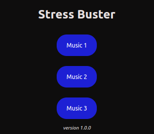

# Stress Buster
A chromium based extension which helps the user in times of stress and anxiety by playing soothing and calm music.

## Research and Analysis:
Music therapy is a powerful tool for alleviating stress by engaging individuals in musical activities tailored to their needs. The rhythmic and melodic elements of music can positively influence emotions, providing a means of expression and relaxation. Through listening, creating, or performing music, individuals often experience reduced stress levels, improved mood, and a sense of connection, making music therapy a valuable resource for promoting mental well-being.

Read more on this: [Music therapy for stress reduction: a systematic review and meta-analysis](https://www.researchgate.net/publication/346786799_Music_therapy_for_stress_reduction_a_systematic_review_and_meta-analysis)

## Demonstration

## Preview of Extension
